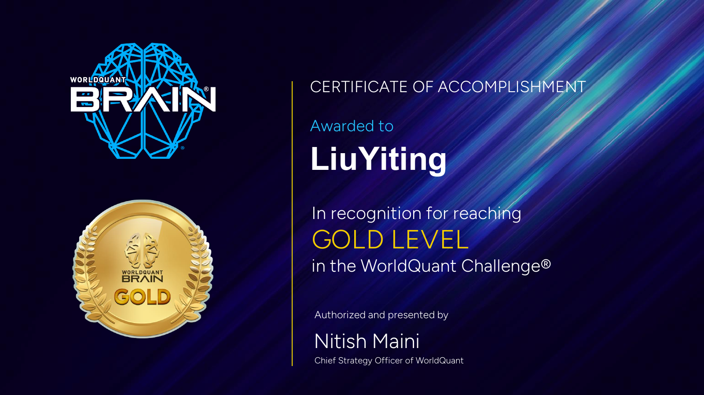
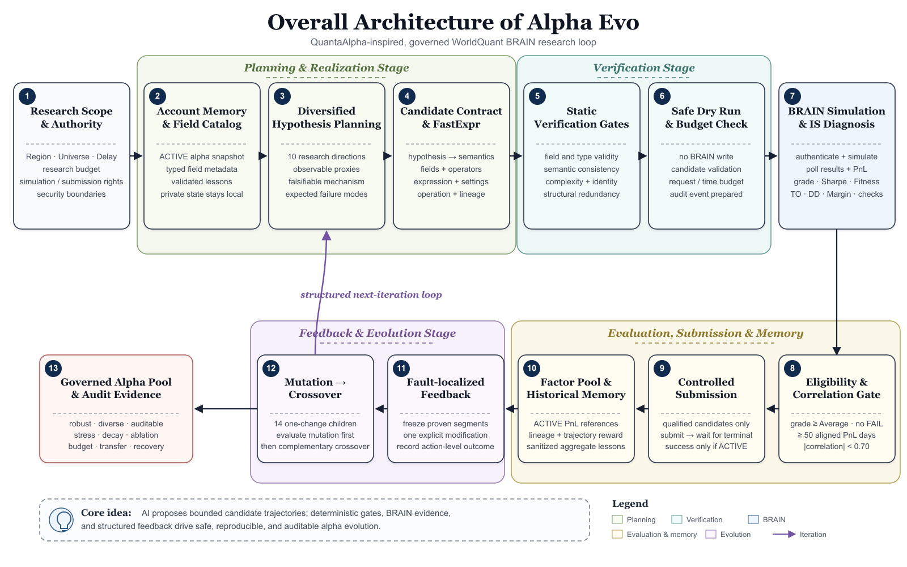

<div align="center">

# Alpha Evo

**Governed WorldQuant BRAIN alpha research powered by trajectory evolution**

从可证伪假设、FastExpr 实现和静态门控，到 BRAIN 模拟、定向变异、互补交叉、相关性治理与受控提交的一体化研究工具包。

</div>

## WorldQuant Challenge - Gold Level

<p align="center">
  <a href="assets/worldquant-challenge-gold-certificate.pdf">
    
  </a>
</p>

This project is maintained by **Liu Yiting**, a **Gold Level** achiever in the WorldQuant Challenge. Click the certificate image to open the original PDF.

## What this project does

Alpha Evo maps QuantaAlpha-style trajectory evolution onto the WorldQuant BRAIN formula-alpha workflow. AI reasoning is used for hypothesis formation and localized feedback, while deterministic Python controls enforce field types, semantic consistency, complexity, lineage, research budgets, PnL correlation, submission eligibility, and auditability.

The system is designed around one principle: a strong backtest is evidence to investigate, not permission to bypass research controls.

## Overall workflow

<p align="center">
  
</p>

The loop separates four concerns:

- **Planning and realization:** synchronize account memory, search typed data fields, diversify hypotheses, and build explicit candidate contracts.
- **Verification and execution:** reject invalid or redundant expressions locally before any BRAIN simulation.
- **Evaluation and submission:** diagnose IS metrics, enforce dynamic ACTIVE-PnL correlation gates, and count a submission as successful only after `status == ACTIVE`.
- **Feedback and evolution:** freeze proven components, make one attributable change per mutation, evaluate mutations before crossover, and preserve complete lineage.

## Core capabilities

- Typed catalog for **4,367 USA TOP3000 Delay 1 fields** across fundamental, analyst, news, price-volume, option, model, and social-media data.
- Structured candidate schema connecting hypothesis, observable proxy, semantic description, FastExpr, settings, operation, and parents.
- Static gates for field validity, type safety, semantic consistency, expression complexity, algebraic identities, and structural redundancy.
- Governed BRAIN simulation with polling, retry handling, metric extraction, PnL collection, and IS-check diagnosis.
- Fixed trajectory reward using Sharpe, Fitness, Returns, Drawdown, Turnover, novelty, complexity, and failed-gate penalties.
- Fault-localized mutation and complementary crossover with action-level feedback and preserved ancestry.
- Factor-pool construction with ACTIVE-alpha daily-PnL correlation control and fail-closed coverage requirements.
- Stress, decay, ablation, transfer, budget, and lineage audits for reproducible research governance.
- Sanitized experience evolution that keeps account identifiers, expressions, PnL, and credentials private.

## Repository layout

```text
.
├── SKILL.md                         # Chinese enterprise research playbook
├── LOCAL_RUNBOOK.md                 # Local operating notes
├── agents/openai.yaml               # Agent metadata
├── assets/                          # Award certificate and architecture figure
├── references/                      # Protocols, schemas, bilingual guides, field catalog
└── scripts/
    ├── brain_client.py              # BRAIN authentication and API client
    ├── field_catalog.py             # Typed field search and synchronization
    ├── evolve_skill.py              # Run lifecycle, evolution, pool, experience
    ├── submit_batch.py              # Validation, simulation, correlation gate, submission
    ├── feedback_generation.py       # Mutation and crossover materialization
    ├── analyze_run.py               # Stability, stress, and convergence analysis
    ├── governance.py                # Lineage, ablation, transfer, and budget audits
    └── selftest.py                  # Offline deterministic verification
```

Private research state is intentionally absent from the repository:

```text
credential.txt
.env*
private/
research_runs/
alpha_db.json
batch_submit_results.json
tmp/
```

## Quick start

### 1. Install the runtime dependency

Python 3.10 or newer is recommended.

```bash
python -m pip install requests
```

### 2. Run the offline verification suite

```bash
python scripts/selftest.py
```

### 3. Search the typed field catalog

```bash
python scripts/field_catalog.py search operating_income \
  --category fundamental \
  --type MATRIX \
  --limit 10
```

### 4. Initialize a governed research run

```bash
python scripts/evolve_skill.py init \
  --run-id demo-run \
  --directions 10 \
  --iterations 5 \
  --max-iterations 15 \
  --candidates-per-direction 2
```

### 5. Validate candidates without accessing BRAIN

```bash
python scripts/submit_batch.py --run-id demo-run --max-candidates 20
```

Dry run is the safe default. Simulation and submission require explicit flags and valid local credentials; see [`references/workflow_en.md`](references/workflow_en.md) or [`references/workflow_zh.md`](references/workflow_zh.md) before enabling either action.

## Credential safety

Preferred configuration uses local environment variables:

```bash
WQ_BRAIN_USERNAME=your_username
WQ_BRAIN_PASSWORD=your_password
```

Never commit credentials, API tokens, cookies, session files, account snapshots, raw PnL, or private research runs. The repository's [`.gitignore`](.gitignore) blocks common secret and session patterns, but every public change should still be reviewed before push.

## Research documentation

- [English workflow](references/workflow_en.md)
- [中文工作流](references/workflow_zh.md)
- [Research protocol](references/research_protocol.md)
- [BRAIN API contract](references/brain_api_contract_en.md)
- [Candidate schema](references/candidate_schema.json)
- [Enterprise controls](references/enterprise_controls_en.md)
- [QuantaAlpha coverage matrix](references/quantaalpha_coverage_matrix.md)

## Disclaimer

This repository is a research and governance toolkit. It does not provide investment advice, guarantee alpha performance, or replace independent validation of data timing, tradability, costs, capacity, robustness, and platform rules.
